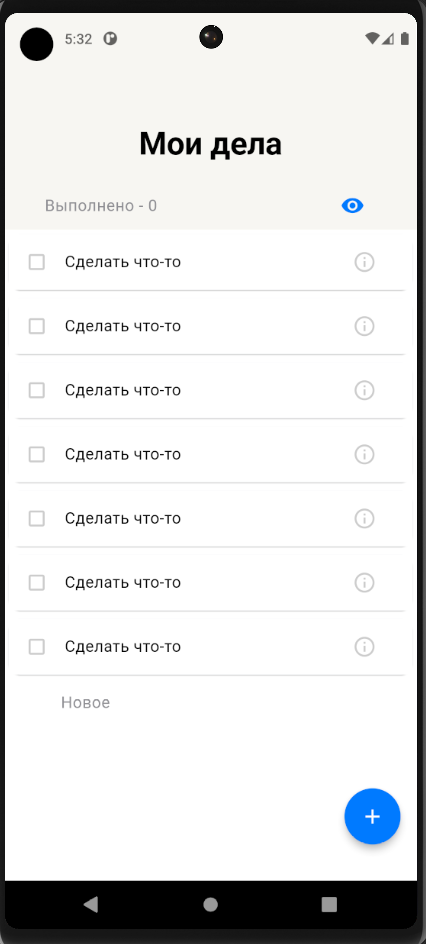
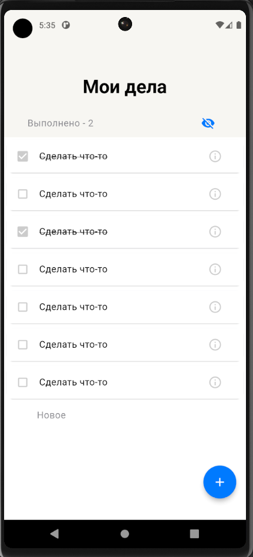
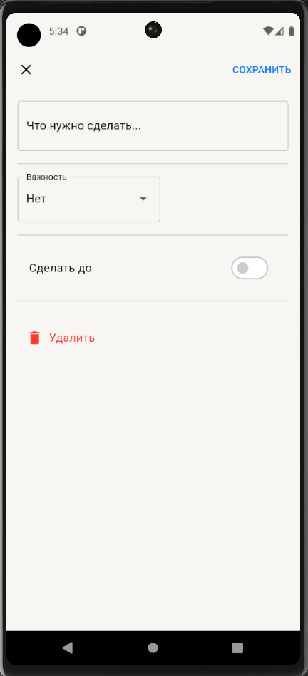

# Todo List Yandex School ШМР

## Описание
Проект Todo List разработан в рамках задания 1 фазы Ada Lovelace на Yandex School ШМР. Приложение представляет собой список задач с основными функциями добавления, редактирования и удаления задач.

## Ссылка на загрузку APK
[Ссылка на загрузку APK](https://drive.google.com/drive/folders/1hYPP6himZ4ATtqFptFuLJqauGp4bg3lD?usp=sharing)

## Экраны
### Главный экран
- Свайп вправо для отметки задачи как выполненной.
- Свайп влево для удаления задачи.
- Подсчет выполенныйх задач.
- Нажатие на иконку глаза позволяет просмотреть выполненные задачи.
- Добавление новой задачи возможно при нажатии на текстовую кнопку "Новое" или кнопку "+".

### Экран добавления/редактирования задачи
- Форма для добавления новой задачи.
- Выбор важности задачи (высокий, низкий и нет).
- Выбор даты дедлайна при нажатии на свитч.
- Возможность удаления существующей задачи и сохранения изменений.

## Использованные пакеты
- Riverpod (flutter_riverpod) для управления состоянием.
- flutter_launcher_icons для добавления иконки приложения.
- logger для логирования.

## Инструкции по запуску
1. Скачайте APK файл приложения на ваш компьютер.

## Авторы
- aanazhi
