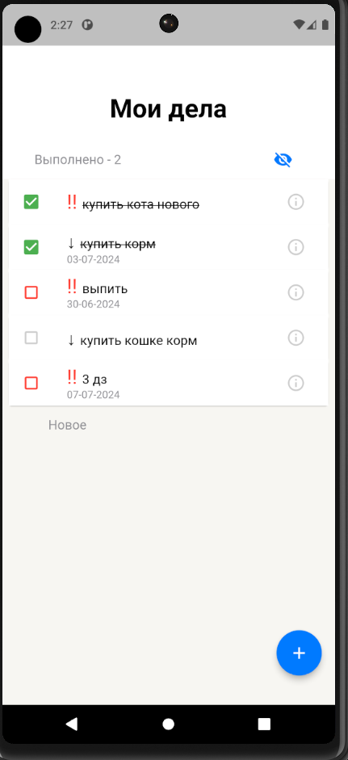

# Todo List Yandex School ШМР

## Описание

Проект Todo List разработан в рамках задания 1 фазы Ada Lovelace, 2 фазы Alan Turing и 3 файзы Bjarne Stroustrup на Yandex School ШМР. Приложение представляет собой список задач с основными функциями добавления, редактирования и удаления задач.


## Ссылка на загрузку APK
[Ссылка на загрузку APK](https://drive.google.com/drive/folders/1hYPP6himZ4ATtqFptFuLJqauGp4bg3lD?usp=sharing)
[Ссылка на релиз из гита](https://github.com/aanazhi/todo_list_yandex/releases/tag/v1.0.0)

## Экраны

### Главный экран
- Свайп вправо для отметки задачи как выполненной.
- Свайп влево для удаления задачи.
- Подсчет выполненных задач.
- Нажатие на иконку глаза позволяет просмотреть выполненные задачи.
- При переходе на иконку информации можно посмотреть или отредактировать задачу.
- Добавление новой задачи возможно при нажатии на текстовую кнопку "Новое" или кнопку "+".


### Экран добавления/редактирования задачи
- Форма для добавления новой задачи.
- Выбор важности задачи (высокий, низкий и нет).
- Выбор даты дедлайна при нажатии на свитч.
- Возможность удаления существующей задачи и сохранения изменений.




## Offline-first
- При отсутствии интернета задачи сохраняются локально.
- При появлении интернета задачи выгружаются на сервер.

## Работа с данными организована в отдельной сущности
- HiveService для работы с задачами локально.
- TasksService для отправки запросов на сервер.

## DI
- DI реализован с использованием Riverpod (файл - task_provider.dart).

## Tests
- Unit-тесты реализованы для сущностей HiveService и TasksService.
- Реализован интеграционный тест для добавления нового дела, команда для запуска: 
```  
  flutter test integration_test/app_test.dart
```  
## Deeplinks
- Поддержан диплинк, открывающий экран добавления нового дела. Команда:
```
  adb shell am start -a android.intent.action.VIEW -d "myapp://addtask"
```  
- Диплинк открывается даже если приложение было убито.
- Слой навигации переписан на Navigator 2.0.

## Использованные пакеты
- flutter_riverpod для управления состоянием.
- flutter_launcher_icons для добавления иконки приложения.
- logger для логирования.
- dio для взаимодействия с сервером.
- hive для сохранения данных на диске.
- device_info_plus для получения информации об устройстве.
- connectivity_plus для отслеживания состояния подключения к интернету.
- path_provider для работы с файловой системой.
- plugin_platform_interface для создания платформенных плагинов.
- path_provider_platform_interface для работы с файловой системой на различных платформах.
- go_router для навигации в приложении.
- test для написания тестов.
- hive_test для тестирования с использованием Hive.
- mockito для создания моков в тестах.

## Инструкции по запуску через .apk
1. Скачайте APK файл приложения на ваше устройство.

## Запросы на сервер
- Обновление списка задач.
- Получение всех задач.
- Удаление конкретной задачи.
- Изменение задачи.
- Добавление новой задачи.

## Методы для локального сохранения
- Сохранить задачу.
- Удалить задачу.
- Получить все задачи.

## Авторы
- aanazhi
